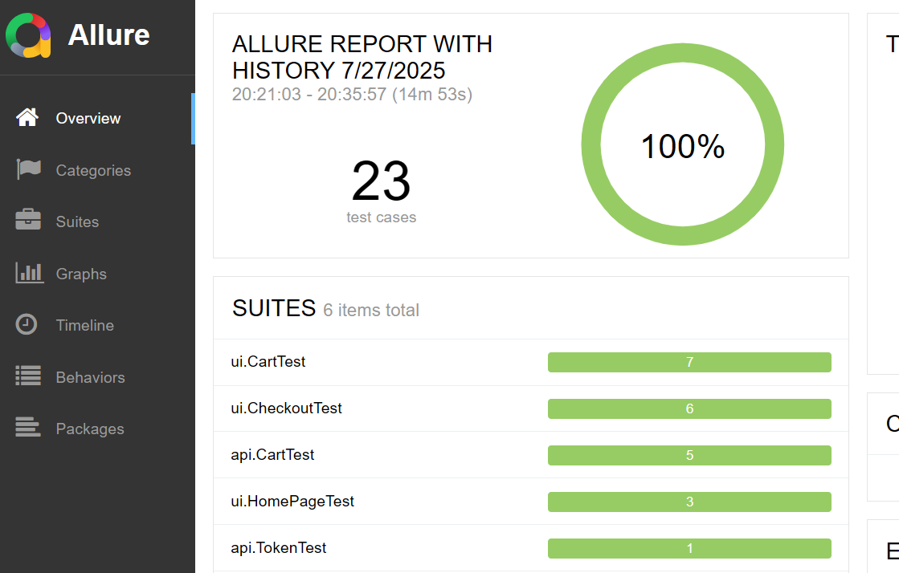
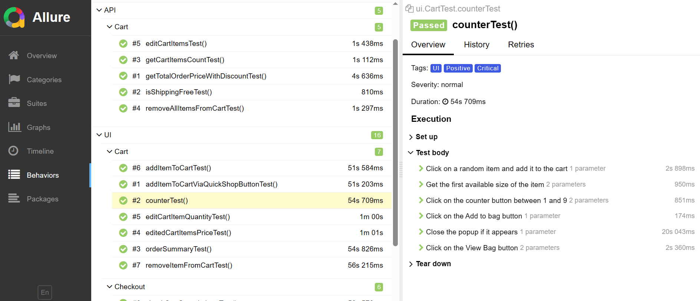
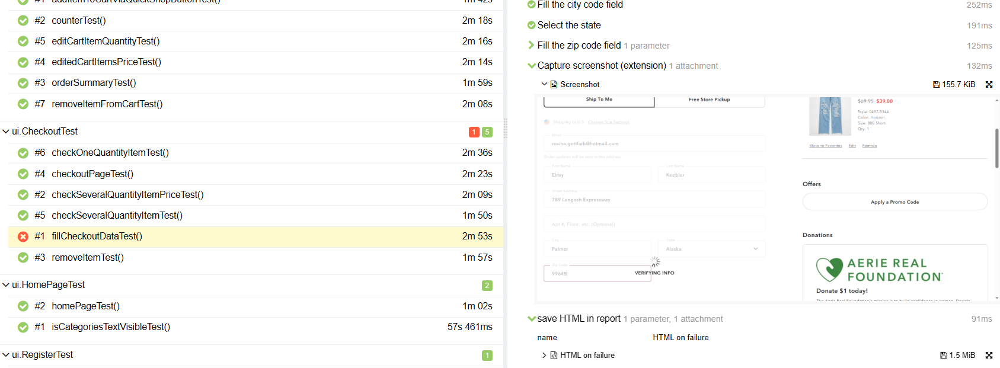

# This is a test automation project for the website of the US clothing, footwear, and accessories brand American Eagle (https://www.ae.com/us/en).
##  Contents:

- [Used technologies](https://github.com/StepanidaKirillina1/American_eagle?tab=readme-ov-file#used-technologies)
- [How to run tests from the command line](https://github.com/StepanidaKirillina1/American_eagle?tab=readme-ov-file#how-to-run-tests-from-the-command-line)
- [View Allure Reports](https://github.com/StepanidaKirillina1/American_eagle?tab=readme-ov-file#view-allure-reports)
- [Test Coverage](https://github.com/StepanidaKirillina1/American_eagle?tab=readme-ov-file#test-coverage)

## Used technologies

Java 17, JUnit5, Gradle, Selenium (UI), RestAssured (API), Allure Reports, Lombok, GitHub Actions (CI/CD)

## How to run tests from the command line

To execute the tests, please run the following command via the command line:
./gradlew clean {task.name}, for instance

`./gradlew clean test`

The tasks' names can be found in build.gradle.

Please ensure all required properties are filled locally.

Also, the values of properties can be passed using the -D flag.

## View Allure Reports

To generate Allure reports, please:
1.	Navigate to the reports directory: cd ./build/
2.	Run `allure serve`

Please verify that the path to /bin is set in your environment variables.

### See Allure Report overview

### Example of Allure Report

### Example of Allure Report screenshot on failure

## Test Coverage

The following scenarios were automated:
-	Adding items to the cart;
-	Quick Shop functionality (adding items via Quick Shop);
-	Increasing item quantity using the counter;
-	Editing the quantity of items in the cart;
-	Removing items from the cart;
-	Price verification on the cart and checkout pages;
-	Quantity verification on the cart and checkout pages;
-	The checkout form completion;
-	New user registration;
-	Existing user authorization;
-	Guest token retrieval;
-	Free shipping option.

